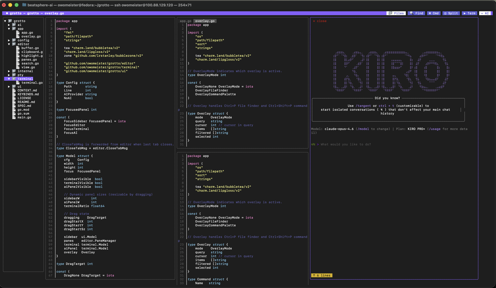
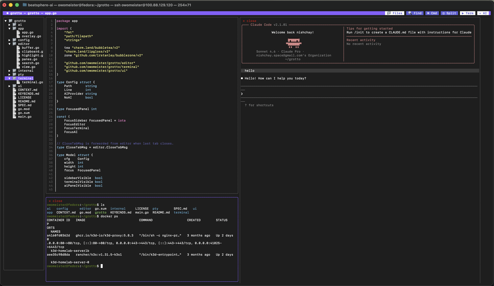
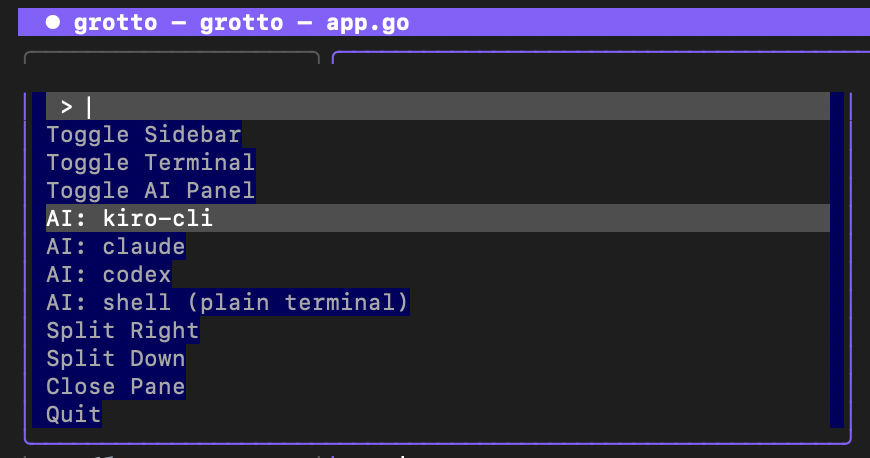

# grotto

A terminal-native TUI code editor built with Go and Bubble Tea v2.


<p align="center">
  
</p>

## Demo

https://github.com/user-attachments/assets/grotto.webm

> Can't see the video? View the [demo recording](screenshots/grotto.webm) directly.

## Features

- **File tree sidebar** — browse, expand/collapse directories, .gitignore filtering
- **Syntax highlighting** — Chroma-powered with Dracula theme
- **Tabs & split panes** — up to 4 panes, shared buffers across panes
- **Find & replace** — incremental search, replace one/all, go-to-line
- **Fuzzy file finder** — Ctrl+P / F1
- **Command palette** — Ctrl+Shift+P / F2
- **Integrated terminal** — multiple tabs, scrollback, mouse wheel scroll
- **AI panel** — embed kiro-cli, claude, codex, or any CLI
- **Mouse-first** — click to place cursor, drag to select, click buttons, right-click drag to resize panels
- **Resizable panels** — right-click + drag any divider
- **Clickable title bar** — buttons for Files, Find, Cmd, Split, Term, AI

## Screenshots

### Split panes with integrated terminal and AI

<p align="center">
  
</p>

### Command palette

<p align="center">
  
</p>

## Install

```sh
go install github.com/nishchaysinha/grotto@latest
```

Or build from source:

```sh
git clone https://github.com/nishchaysinha/grotto
cd grotto
go build -o grotto .
```

## Usage

```sh
grotto                    # open current directory
grotto .                  # same
grotto ~/projects/myapp   # open a directory
grotto main.go            # open a file
grotto main.go:42         # open file at line 42
grotto --ai claude        # set AI provider
grotto --no-ai            # disable AI panel
grotto --version          # print version
```

## Keybindings

See [KEYBINDS.md](KEYBINDS.md) for the full reference. Highlights:

| Key | Action |
|-----|--------|
| Ctrl+Q | Quit |
| Ctrl+B | Toggle sidebar |
| F1 / Ctrl+P | Fuzzy file finder |
| F2 / Ctrl+Shift+P | Command palette |
| F3 / Ctrl+` | Toggle terminal |
| F4 / Ctrl+Shift+A | Toggle AI panel |
| Ctrl+F | Find |
| Ctrl+H | Find & replace |
| Ctrl+G | Go to line |
| Ctrl+\\ | Split right |
| Ctrl+W | Close tab |
| Right-click + drag | Resize panels |

## Architecture

```
app.Model (root)
├── Overlay (file finder / command palette)
├── ui.Model (sidebar file tree)
├── PaneManager (1-4 editor panes)
│   └── editor.Model (tabs, buffer, syntax highlighting, search)
├── terminal.Model (integrated terminal, multi-tab)
└── terminal.Model (AI panel, spawns AI CLIs)
```

## Dependencies

- [Bubble Tea v2](https://charm.land/bubbletea) — TUI framework
- [Lip Gloss v2](https://charm.land/lipgloss) — terminal styling
- [BubbleZone v2](https://github.com/lrstanley/bubblezone) — mouse zone detection
- [Chroma v2](https://github.com/alecthomas/chroma) — syntax highlighting
- [creack/pty v2](https://github.com/creack/pty) — PTY spawning
- [vt10x](https://github.com/ActiveState/vt10x) — VT100 terminal emulator

## License

GPL-3.0
